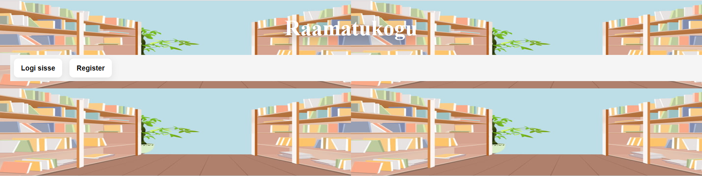
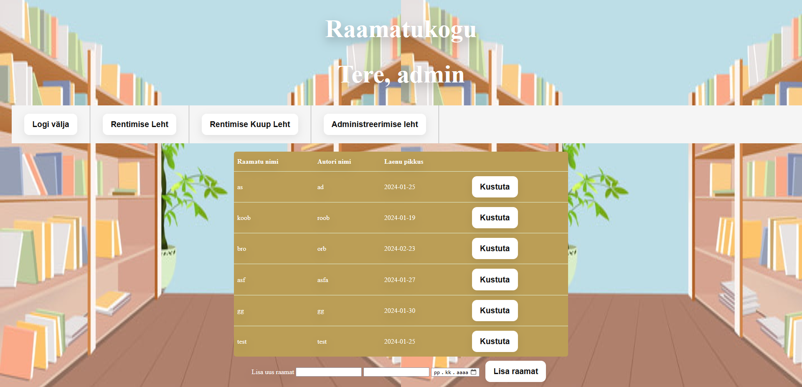
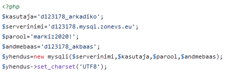
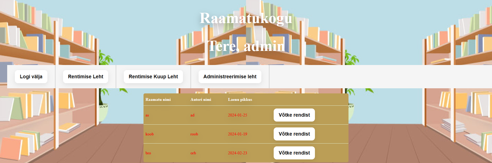
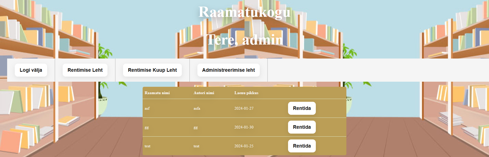

# Raamatukogu

## Haldus Leht
*See on minu projekti peamenüü, kus toimub enamik asju.*

Sellel leheküljel on ka 3 versiooni: Kasutaja ja administraator. Lehekülje mitte sisselogitud versioonis on 2 nuppu sisselogimiseks või registreerimiseks, kui olete sisse logitud kasutajana, siis on 3 nuppu välja logimiseks, raamatu rentimiseks ja rendiinfo vaatamiseks, kui olete sisse logitud administraatorina, siis on 4 nuppu välja logimiseks, raamatute lisamiseks või muutmiseks.

**Näiteks:**
- Registreerimine
- Logi sisse
- Administraatori ja kasutaja õigused
### conf.php
*Konfigureerib andmebaasi vahelise ühenduse*

## Kuup Leht
*Räägib kogu informatsiooni üürimise kohta*

Kui aega on jäänud rohkem kui nädal, on see värvitud roheliseks, kui vähem kui nädal, on see värvitud oranžiks, kui aegunud, on see värvitud punaseks.

## Login Leht
*Aken sisselogimiseks*

Ma ei saanud teha ekraanipilti, kuid võite seda näha, kui külastate veebilehte.
## Register Leht
*Registreerimise aken*

Ma ei saanud teha ekraanipilti, kuid võite seda näha, kui külastate veebilehte.
## Rentimise Leht
*Aken raamatute rentimiseks*

Saate raamatu rentida ja see kaob kasutaja jaoks ära, kuid näitab administraatorile kättesaadavuse andmeid.

## Style.css
***Stiili kõik on salvestatud siin***
### Link
Veebisaiti saab vaadata [siit](https://arkadikorotots22.thkit.ee/jsleht/content/andmebaas/raamatukogu/haldusLeht.php).
